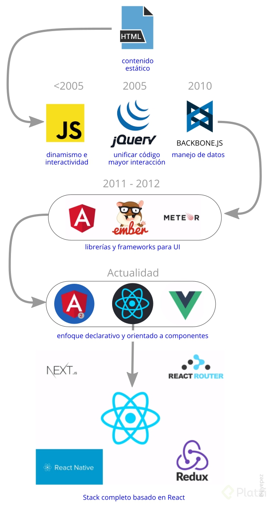

#¿Por qué aprender React?

**React** = Librería de JavaScript para construir interfaces de usuarios.

Las necesidades del Frontend han ido en aumento a medida que han pasado los años.
Todo el enfoque ha sido encaminado a mejorar todos los aspectos que hagan que la experiencia de usuario sea mucho mejor, esto le ha dado más responsabilidades al área de Frontend.

**Particularidades de ReactJS:**

- **Declarativo.** Es muy sencillo escribir interfaces y poderlas leer.
- **Basado en componentes.**
- **Aprende de una vez y escribe donde quieras.**

- React. Aprender el core.
- React router. Navegar sin recargar el browser.
- Redux. Manejar el estado global de la aplicación.
- React Native. Interfaces de aplicaciones mobiles.
- Next.js. Framework en el servidor.
